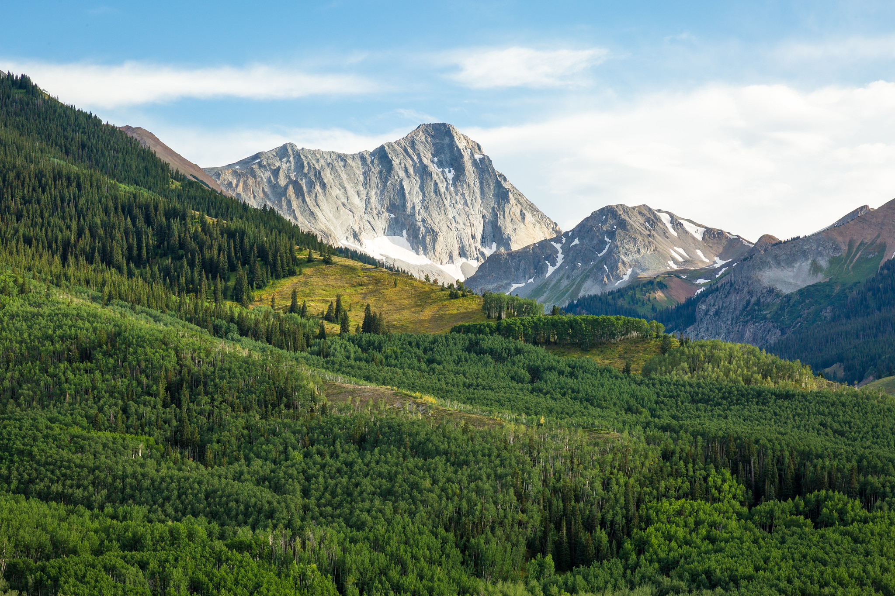

# t14 - The Fourteeners

**Capitol Peak in the Elk Mountains (14,137 feet)** - Pitkin County, Colorado ([source](https://www.flickr.com/photos/twilberding/48722571706/in/photolist-2herV6L-xvg9J-rZLG2-R4LGuG-VbA5JN-sjzRz1-VbA53N-RezZz9-uUsST1-sMdroQ-UufZCN-VbA3Nd-UufZS5-y7mY94-uTqiN2-4QG3zj-rYwwH4-z1Wd9d-24VjTyv-7Xjj4n-7YsgTC-t6Erku-EXGqUv-z4eJK6-QWFRJy-z541CR-4QBQfK-waUYNN-UufZYh-yLCCAy-4QBPZg-DcLT3-dNxsB9-sAyzMp-bnZE8H-tUSfvv-8Afae8-yLCyXm-oqgDwg-6uYtLX-8AhVSW-8AipsW-8AhVFA-8AeQC2-FN2LcH-FnVwgs-FDRy3h-ESAbZC-FnVnW1-qpDBsb)) 

## Members
| Last | First | eName | GitHub | Email |
| ---- | ----- | ----- | ------ | ----- |
| Denehan | Rylie | rylied | RylieDD | rylied@rams.colostate.edu |
| Harter | Darin | darinh | darin3 | darinh@rams.colostate.edu |
| Powell | Mikayla | cessna17 | cessna17 | cessna17@rams.colostate.edu |
| Varela | Edgar | edvarela | edgarv24 | edvarela@rams.colostate.edu |

## Team Preferences 
  The team’s expectations for what will be accomplished this semester are: work efficiently, understand the tools introduced in the course, help each other with any questions or tasks, and have fun. The goals of the team for this semester are to be individually dependable, evenly divide responsibility and maintain an understanding and dialog concerning the process and project, and reach out and accept help when needed. Obstacles that the team might encounter while attempting to reach their goals could be time management, communicating effectively as a team while remote, reaching out for help, and quickly learning new technologies. The team’s position on how to handle some people wanting an “A” while others think a “B” is acceptable is to talk with each other and aim for achieving an “A”. However, the team will be realistic with their goals of achieving an “A” when time limits are concerned. 
  
  The team also believes that it is not acceptable for some team members to do more work on the assignment in order to get an “A”. The team will strive to balance the workload and rely on each other. The team will work on the project one to two hours a day in order to make the project successful. However, more time may be required in order to accomplish more difficult tasks. The tasks will be assigned according to the strengths and weaknesses of each team member initially, but there will be some flexibility there with roles evolving over time. If a team member does not follow through on a commitment, such as missing a deadline or not showing up for a meeting, the team will communicate with that individual in order to straighten things out or get on the same page. If this happens more than once or twice, the team will bring in a TA and/or Dave to figure out the issue.
  
